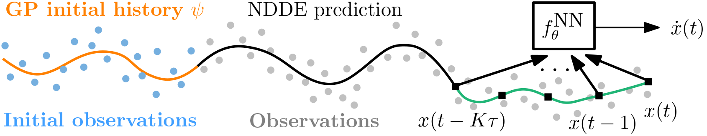

# Stable time-delay systems
[**Requirements**](#requirements)
| [**Training**](#training)
| [**Contributing**](#contributing)

This repository is the official implementation of [Learning Stable Deep Dynamics Models for Partially Observed or Delayed Dynamical Systems](https://arxiv.org/abs/2110.14296).

<p align="center">

</p>

## Requirements
All requirements are summarized in the Project.toml file.

## Training
This code implements stable Neural DDEs. To reproduce our results simply run the python scripts in src/experiments/:
- scr/experiments/train_ANODE_cos.jl
- scr/experiments/train_NDDE_cos.jl
- src/experiments/train_n_pendulum_LRF_alongtraj.jl
- src/experiments/train_n_pendulum_unstable.jl
- src/experiments/train_inverted_pendulum_LRF_alongtraj.jl


## Contributing

If you would like to contribute to the project please reach out to [Andreas Schlaginhaufen](mailto:andreas.schlaginhaufen@alumni.ethz.ch?subject=[stable-NDDE]%20Contribution%20to%20stable-NDDE). If you found this library useful in your research, please consider citing.
```
@article{schlaginhaufen2021learning,
      title={Learning Stable Deep Dynamics Models for Partially Observed or Delayed Dynamical Systems},
      author={Andreas Schlaginhaufen, Philippe Wenk, Andreas Krause and Florian Dörfler},
      journal={Advances in Neural Information Processing Systems},
      year={2021},
}
```
